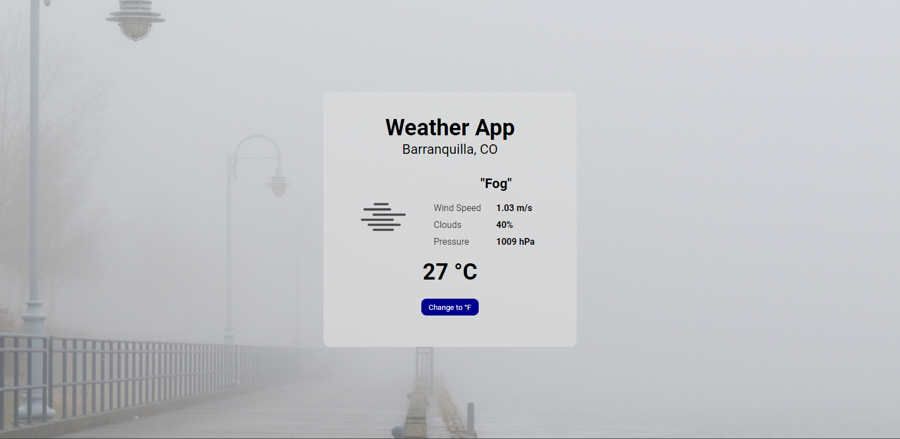

# Weather App



## Demo

Puedes ver una demostración de la aplicación [aquí](enlace-a-la-demo).

## Descripción

Esta es una aplicación de clima que utiliza la Weather API para mostrar datos climáticos en tiempo real. La aplicación muestra fondos dinámicos según el tiempo y la hora del día. Está desarrollada con React y utiliza la API de geolocalización del navegador para obtener la ubicación del usuario.

## Características

- Muestra datos climáticos en tiempo real utilizando la Weather API.
- Cambia dinámicamente el fondo de acuerdo al clima y la hora del día.
- Convierte la temperatura entre Celsius y Fahrenheit.
- Proporciona una experiencia de usuario intuitiva y atractiva.


## Instalación

1. Clona este repositorio en tu máquina local.
2. Navega hasta la carpeta del proyecto.
3. Ejecuta el siguiente comando para instalar las dependencias:

   ```
   npm install
   ```

4. Una vez que las dependencias estén instaladas, inicia la aplicación con el siguiente comando:

   ```
   npm run dev
   ```

5. Abre tu navegador y accede a `http://localhost:5173` para ver la aplicación en funcionamiento.


## API Key

Esta aplicación utiliza la API Weather API para obtener datos climáticos. Asegúrate de obtener una clave de API válida registrándote en el sitio web de Weather API. Una vez que hayas obtenido la clave de API, guárdala en un archivo `getApiKey.js` en la carpeta `utils` de tu proyecto con el siguiente contenido:

```javascript
const getApiKey = () => {
  return "TU_CLAVE_DE_API_AQUÍ";
};

export default getApiKey;
```

Reemplaza `"TU_CLAVE_DE_API_AQUÍ"` con tu clave de API obtenida.

## Contribución

_Si deseas contribuir a este proyecto, sigue los pasos a continuación:_

1. Haz un fork de este repositorio.
2. Crea una rama con el nombre de tu función o corrección de errores: `git checkout -b nombre-de-la-rama`.
3. Realiza los cambios deseados y guarda los archivos.
4. Realiza una confirmación describiendo tus cambios: `git commit -m 'Descripción de los cambios'`.
5. Envía tus cambios a la rama principal: `git push origin nombre-de-la-rama`.
6. Abre una pull request explicando los cambios propuestos.

## Licencia

Este proyecto está licenciado bajo la Licencia MIT. Consulta el archivo [LICENSE](LICENSE) para obtener más detalles.

